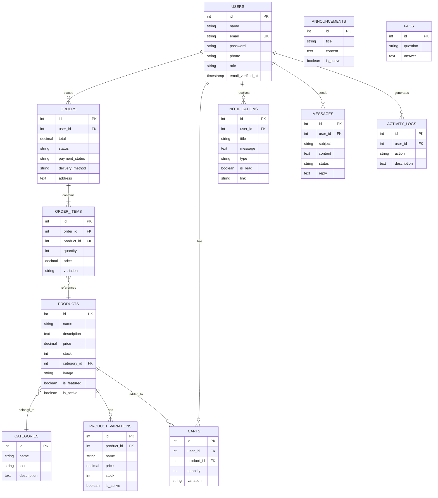

# 🌿 Leafé Mart

**Leafé Mart Mahallah Bilal Web Application** is an e-commerce platform developed for the residents of Mahallah and students of IIUM. The application aims to transform the current purchasing activities into a convenient, modern, and user-friendly digital shopping experience.


**GitHub Link:** https://github.com/aqilfrhn/leafemart

---

## 📖 Course Information

| | |
|---|---|
| **Course** | INFO 3305 - Web Application Development |
| **Semester** | Semester 1, 2025/2026 |
| **Section** | 3 |
| **Group** | 4 |
| **Kulliyyah** | Information & Communication Technology (KICT) |
| **Lecturer** | Dr. Najhan Bin Muhamad Ibrahim |

---

## 👥 Team Members

| Name | Matric No. | Assigned Task |
|------|-----------|---------------|
| Ghassan Bin Sharifuddin | 2112819 | Project Scope & Constraints |
| Ahmad Danish Qayyim Bin Azmi | 2310789 | Coding (Views & Models) |
| Naila Saleem | 2312934 | Significance & Coding (Routes & Controllers) |
| Idham Zakwan Bin Mat Yazi | 2318121 | Introduction, Problem & Objectives |
| Muhamad Aqil Ikhwan Bin Ab Rahman | 2215761 | Demo & System Development |

---

## � 1.1 Introduction

The Leafé Mart Mahallah Bilal Web Application is an e-commerce platform developed for the residents of Mahallah and students of IIUM. The application aims to transform the current purchasing activities into a convenient, modern, and user-friendly digital shopping experience.

Currently, most shopping within Mahallah Bilal relies on physical visits to the mart, a process that can be time-consuming, particularly during peak hours, exam seasons, or when students have tight schedules. This web application addresses this challenge by providing a solution for online purchasing.

This project delivers a fully functional web application enabling users to browse products, check availability, view prices, and make seamless purchases online. The platform features a modern, clean visual design and a responsive layout to ensure an aesthetically pleasing and consistent experience on both mobile and desktop screens.

---

## 🔴 1.2 Problem Description

### 1.2.1 Background of the Problem

The students experience challenges like a tight class timetable, uncertain stock, and a long queue of people lining up especially when it comes to peak hours. There is no online platform for users to search for items available for purchase in advance and store information.

Because of the growing dependency on online services in IIUM campuses, as well as for the convenience of Mahallah residents, a web application will provide a way for Leafé Mart to upgrade and simplify their operation. This application would benefit users with an organized, accessible, and user-friendly means of dealing with the store without requiring their presence.

### 1.2.2 Problem Statement

1. **No Online Product Visibility** — Users cannot check for the product availability, view prices, or categories without physically visiting the store.

2. **Limited Operating Hours Information** — Students cannot know if the store is open or closed without checking physically.

3. **No Order or Reservation System** — Students cannot order or reserve items, which could lead to disappointment when the items run out of stock.

4. **Inefficient Inventory Updates** — Staff operators manually track the stock, which may cause some errors and delays.

5. **Long Queues and Congestion** — During peak hours, the store gets crowded, causing slow checkout and inconvenience.

---

## 🎯 1.3 Project Objectives

The project objectives are as follows:

1. **To make shopping process digitalized**
   - By giving students an easy-to-use online platform to browse products, check prices, and see stock availability.

2. **To assist Leafé Mart staff in managing operations**
   - Provide an admin dashboard for managing products, categories, stock, orders, and announcements in a systematic manner.

3. **To enhance user experience**
   - Develop a modern, responsive, and user-friendly interface accessible on both mobile and desktop devices.

4. **To reduce long queues and overcrowding**
   - By offering an online alternative that allows students to check items and place simulated orders without physically visiting the mart during peak hours.

5. **To approve communication with customers**
   - By providing clear and timely updates, operational hours, and announcements directly through web applications.

---

## 📐 1.4 Project Scope

The scope of the Leafé Mart Mahallah Bilal Web Application focuses on digitalizing the current purchasing experience and improving operational efficiency. The system includes essential customer-facing features for browsing and purchasing, as well as internal administrative module to help staff manage products and inventory more effectively.

### Customer Module
- User registration & login
- Browse and search products
- Add to cart, checkout, payment simulation
- Order tracking
- View order history
- Notifications & announcements

### Admin Module
- Admin authentication
- Product management (CRUD)
- Category management
- Order management
- User management

---

## ⚠️ 1.5 Constraints

The development of the Leafé Mart web application is subject to several limitations that may affect the design, functionality, and timeline of the project. These constraints include:

### Technical Constraints
- No real-time connection to the physical store's actual inventory; stock updates depend on manual input from staff.
- Payment gateway integration may not be implemented due to time and budget restrictions; transactions may be simulated.
- The system relies on the team's understanding of Laravel, which may require additional learning time.
- Deployment is limited to available resources, such as localhost if hosting is unavailable.

### Network Requirements
1. Stable internet connection
2. Browser access (Chrome, Firefox)

### Additional Infrastructure Limitations
If the Kulliyyah does not provide a hosting server, the project will be demonstrated on a localhost to ensure smooth execution. Alternatively, free hosting options or temporary educational hosting platforms may be considered to allow online deployment for presentation purposes. This approach ensures that the development continues without interruption, despite any institutional limitations.

---

## 📅 1.6 Project Stages

| Phase | Activity | Duration | Start | Finish |
|-------|----------|----------|-------|--------|
| 1 | Requirement Gathering | 3 weeks | 6/10/2024 | 27/10/2024 |
| 2 | Project Unit Development | 1 week | 27/10/2024 | 3/11/2024 |
| 3 | Database Design & Development | 1 week | 27/10/2024 | 3/11/2024 |
| 4 | Implementation | 4 weeks | 3/11/2024 | 1/12/2024 |
| 5 | Integration & Testing | 2 weeks | 1/12/2024 | 15/12/2024 |
| 6 | Report Writing & Presentation | 2 weeks | 15/12/2024 | 29/12/2024 |

---

## 💡 1.7 Significance of the Project

### For Students (19-25 years old)
1. Provides a convenient way to browse products, check prices, and view stock availability anytime.
2. Reduces long queues and unnecessary trips to the mart during peak hours.
3. Helps students plan their purchases better with updated information and stock availability.
4. Offers a smoother and more modern shopping experience through a responsive interface.

### For Leafé Mart Staff (25-50 years old)
1. Simplifies daily tasks with an organized admin panel for product and inventory management.
2. Reduces errors caused by manual stock tracking or inconsistent updates.
3. Saves time by reducing repeated customer enquiries about item availability or pricing.
4. Improves workflow through a systemized order and category management process.

---

## 💻 1.8 Coding

### a) Public Routes
Accessible to everyone (no login required):
- `/` — Homepage
- `/browse` — Browse products
- `/product/{id}` — View product details
- `/search` — Product search
- `/about`, `/faq` — Static pages

These routes allow general users to explore the platform.

### b) Demo Setup Route
- `/demo-setup`
  - Automatically creates:
    - Admin demo account
    - Customer demo account
  - Used for testing
  - Redirects to login after setup

Helps simulate a real e-commerce system.

### c) Authentication Routes (Guest Only)
For users who are not logged in:
- Login
- Register
- Forgot password
- Reset password
- Resend reset code

Handles user access and account recovery.

### d) Email Verification Routes
For logged-in users:
- Email verification notice
- Send verification code
- Verify email
- Resend code

Ensures account security and valid users.

### e) Authenticated Customer Routes
For logged-in customers:
- **Cart**: View, add, update, remove, clear items
- **Orders**: Checkout, place order, view history, cancel
- **Profile**: View, update, change password, delete account
- **Notifications**: View, mark as read

Core shopping and user management features.

### f) Admin Routes
For administrators (`/admin` prefix):
- **Dashboard**: Statistics and activity logs
- **Products**: Full CRUD operations
- **Categories**: Full CRUD operations
- **Orders**: View and update status
- **Variations**: Manage product variations
- **Messages**: Customer inquiries
- **Users**: View and manage
- **FAQs**: Full CRUD operations
- **Announcements**: Create and send

Applies authentication and role control.

---

### Controllers

#### 1. OrderController.php
The OrderController manages the order process for users. It allows users to view their order history, add items to orders, and complete order checkout. Additionally, the controller allows users to view order details, check order status, and cancel pending orders, while automatically generating notifications for both customers and administrators.

#### 2. ProductController.php
The ProductController manages product browsing and display functions for users. It allows users to browse products by category, view individual product details, and search for products using keywords. This controller ensures that only active and in-stock products are shown, and it also displays related products to improve user experience and product discovery.

#### 3. ProfileController.php
The ProfileController manages user profile and account-related functions. It allows authenticated users to view and update personal information, change passwords, and manage profile actions. This controller also handles user notifications, including viewing, filtering, marking notifications as read, and redirecting users based on notification actions. Additionally, it provides functionality for secure account deletion, ensuring all related user data is properly removed.

---

### Models

#### 1. ActivityLog.php
**Purpose:** This model tracks and stores system activities such as admin actions, user interactions, and system events.
**Explanation:** It is linked to a user and supports dynamic icons and colors based on action type. A static `log()` method simplifies recording activities across the system.

#### 2. Announcement.php
**Purpose:** This model manages system announcements displayed to users.
**Explanation:** It stores announcement title, content, and activation status. The active scope allows the system to easily retrieve only announcements that are currently visible to users.

#### 3. Cart.php
**Purpose:** This model represents items added to a user's shopping cart.
**Explanation:** It links users with products and stores selected variations and quantities. The subtotal accessor automatically calculates the total price per cart item, considering product variations if applicable.

#### 4. Category.php
**Purpose:** This model manages product categories.
**Explanation:** Each category contains multiple products and includes attributes such as name, icon, and description. It helps organize products for browsing and filtering in the e-commerce system.

#### 5. Faq.php
**Purpose:** This model stores frequently asked questions for users.
**Explanation:** Each FAQ entry includes a question and an answer. It provides a simple way to display helpful information.

#### 6. Message.php
**Purpose:** This model manages customer messages or inquiries.
**Explanation:** It tracks the sender (user), subject, content, and status. It supports replies and read status for admin management.

#### 7. Notification.php
**Purpose:** This model handles user notifications.
**Explanation:** Notifications include title, message, type, and read status. They support icons, colors, and redirection links based on notification type.

#### 8. Order.php
**Purpose:** This model represents customer orders.
**Explanation:** Orders include user reference, total amount, status, payment status, and delivery details. It links to order items and calculates totals.

#### 9. OrderItem.php
**Purpose:** This model stores individual items within an order.
**Explanation:** It references products, stores quantity, price, and variation. It calculates subtotals for each line item.

#### 10. Product.php
**Purpose:** This model manages products in the system.
**Explanation:** Products include name, description, price, stock, and featured status. They belong to categories and can have multiple variations.

#### 11. ProductVariation.php
**Purpose:** This model manages product variations such as size or type.
**Explanation:** Each variation belongs to a product and may have its own price and stock. Query scopes help retrieve only active or in-stock variations.

#### 12. User.php
**Purpose:** This model manages system users, including customers and administrators.
**Explanation:** It stores user credentials, profile information, roles, and verification status. The model defines relationships with carts, orders, and notifications, and includes role-checking methods for access control.

---

### Views (Blade Files)

| # | File | Purpose |
|---|------|---------|
| 1 | about.blade.php | Displays the About Us page |
| 2 | browse.blade.php | Shows the product browsing page |
| 3 | cart.blade.php | Shopping cart view |
| 4 | checkout.blade.php | Checkout process page |
| 5 | faq.blade.php | Frequently asked questions |
| 6 | home.blade.php | Homepage with featured products |
| 7 | notifications.blade.php | User notifications page |
| 8 | orders.blade.php | My orders/order history |
| 9 | order-detail.blade.php | Individual order details |
| 10 | product.blade.php | Product detail page |
| 11 | profile.blade.php | User profile view |
| 12 | profile-settings.blade.php | Profile settings/edit |

---

## ✨ Features

### Customer Features
- 🛒 **Smart Shopping Cart** - Multi-variation support, real-time quantity updates
- 🔍 **Product Search & Browse** - Filter by categories, search by name
- 📦 **Order Management** - Track orders with status filters
- 🔔 **Real-time Notifications** - Livewire-powered notification badges
- 👤 **Profile Management** - Update personal info, change password
- 🔐 **Secure Authentication** - Email verification, password reset

### Admin Features
- 📊 **Dashboard** - Overview with statistics and activity logs
- 📦 **Product Management** - CRUD operations with variations
- 🏷️ **Category Management** - Organize products by category
- 📋 **Order Management** - Update order and payment status
- 👥 **User Management** - View and manage customers
- 📢 **Announcements** - Send notifications to all users

---

## 🛠️ Technology Stack

| Technology | Purpose |
|------------|---------|
| Laravel 12 | Backend Framework |
| PHP 8.2+ | Server-side Language |
| MySQL | Database |
| Blade | Templating Engine |
| Livewire 3 | Real-time Components |
| CSS3 | Styling & Animations |

---

## 📋 Requirements

- PHP >= 8.2
- Composer
- MySQL/MariaDB
- XAMPP/WAMP/Laravel Valet (or similar)
- Node.js (optional, for asset compilation)

---

## 🚀 Installation

1. **Clone the repository**
   ```bash
   git clone https://github.com/aqilfrhn/leafemart.git
   cd leafemart
   ```

2. **Install dependencies**
   ```bash
   composer install
   ```

3. **Configure environment**
   ```bash
   cp .env.example .env
   php artisan key:generate
   ```

4. **Setup database**
   - Create a MySQL database named `leafemart`
   - Update `.env` with your database credentials:
     ```
     DB_DATABASE=leafemart
     DB_USERNAME=root
     DB_PASSWORD=
     ```

5. **Run migrations and seeders**
   ```bash
   php artisan migrate
   php artisan db:seed
   ```

6. **Link storage**
   ```bash
   php artisan storage:link
   ```

7. **Start the server**
   ```bash
   php artisan serve
   ```

8. **Visit the application**
   ```
   http://127.0.0.1:8000
   ```

---

## 📝 1.9 Summary

This report outlines a complete Laravel MVC web application designed to digitalize Leafé Mart Mahallah Bilal's operation. The system addresses key problems such as lack of online product visibility, long queues, manual stock tracking, and limited operational information.

The project aims to create a user-friendly platform where students can browse items, check stock, and place simulated orders, while staff and management benefit from organized product, inventory, and announcement management. By the end of the project, the team delivered a responsive, modern, and efficient e-commerce application that enhances convenience for students and improves operational workflow for Leafé Mart.

---

## 📊 Entity Relationship Diagram (ERD)



---

## 📸 Screenshots

### Customer Interface

#### Homepage
*Welcome page with featured products carousel and category browsing*


#### Browse Products
*Product grid with category filters and search functionality*


#### Shopping Cart
*Cart with variation support and quantity controls*


#### Product Detail
*Individual product page with variations and add to cart*
<!-- TODO: Add screenshot - Navigate to any product detail page -->

#### Checkout Page
*Order summary and delivery method selection*
<!-- TODO: Add screenshot - Go to /checkout with items in cart -->

#### Order History
*User's past orders with status filters*
<!-- TODO: Add screenshot - Go to /orders while logged in -->

#### Login Page
*User authentication with remember me option*
<!-- TODO: Add screenshot - Go to /login -->

#### Registration Page
*New user signup form*
<!-- TODO: Add screenshot - Go to /register -->

#### Notifications
*User notification center with filtering*
<!-- TODO: Add screenshot - Go to /notifications while logged in -->

#### Profile Settings
*User profile management and password change*
<!-- TODO: Add screenshot - Go to /profile/settings -->

---

### Admin Interface

#### Admin Dashboard
*Dashboard with statistics, recent orders, and activity logs*


#### Product Management
*Admin product list with CRUD operations*
<!-- TODO: Add screenshot - Go to /admin/products -->

#### Add/Edit Product
*Product form with variation management*
<!-- TODO: Add screenshot - Go to /admin/products/create -->

#### Category Management
*Category list and management*
<!-- TODO: Add screenshot - Go to /admin/categories -->

#### Order Management
*All orders with status update functionality*
<!-- TODO: Add screenshot - Go to /admin/orders -->

#### User Management
*Customer list and details*
<!-- TODO: Add screenshot - Go to /admin/users -->

---

### 📱 Suggested Additional Screenshots

| # | Page | URL | Description |
|---|------|-----|-------------|
| 1 | Login | `/login` | Authentication page |
| 2 | Register | `/register` | User signup form |
| 3 | Product Detail | `/product/{id}` | Single product with variations |
| 4 | Checkout | `/checkout` | Order placement |
| 5 | Order History | `/orders` | Past orders list |
| 6 | Notifications | `/notifications` | User notifications |
| 7 | Profile | `/profile` | User profile page |
| 8 | FAQ | `/faq` | Frequently asked questions |
| 9 | About | `/about` | About us page |
| 10 | Admin Products | `/admin/products` | Product management |
| 11 | Admin Orders | `/admin/orders` | Order management |
| 12 | Admin Users | `/admin/users` | User management |

---

## 📁 Project Structure

```
leafemart/
├── app/
│   ├── Http/Controllers/     # Controllers
│   ├── Livewire/             # Livewire components
│   └── Models/               # Eloquent models
├── database/
│   ├── migrations/           # Database migrations
│   └── seeders/              # Database seeders
├── resources/
│   └── views/                # Blade templates
├── routes/
│   └── web.php               # Web routes
└── public/                   # Public assets
```

---

## 📚 1.10 References

- Laravel Documentation
- Livewire Documentation
- IIUM Course Materials (INFO 3305)

---

## 📄 License

This project is developed for educational purposes as part of the Web Application Development (INFO 3305) course at IIUM.

---

## 🙏 Acknowledgments

- **International Islamic University Malaysia (IIUM)**
- **Kulliyyah of Information & Communication Technology (KICT)**
- **Dr. Najhan Bin Muhamad Ibrahim** (Lecturer)
- **Laravel Framework**
- **Livewire**
